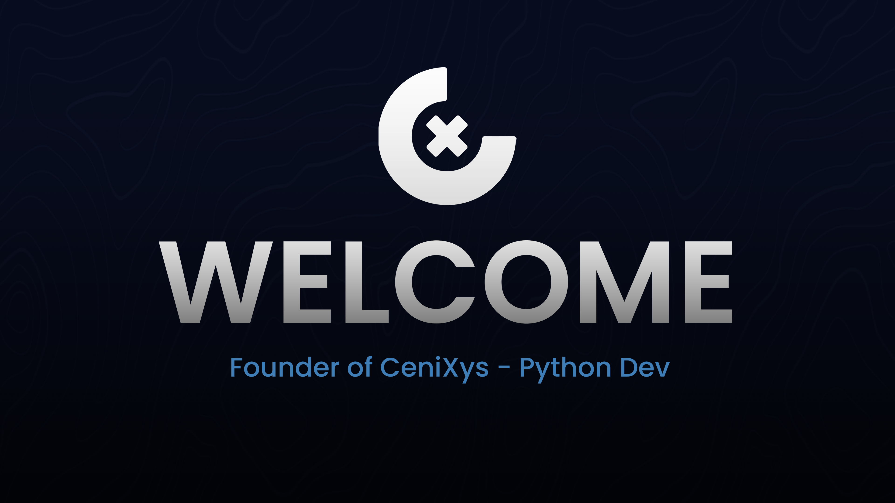

<h1 align="center">Hi 👋, I'm TopeQue</h1>
<h3 align="center">Just a Python dev :D </h3>
<h4 align="center">“I invented nothing new. I simply assembled the discoveries of other men behind whom were centuries of work. Had I worked fifty or ten or even five years before, I would have failed. So it is with every new thing. Progress happens when all the factors that make for it are ready, and then it is inevitable. To teach that a comparatively few men are responsible for the greatest forward steps of mankind is the worst sort of nonsense.† ― Henry Ford</h4>

  

- 🔭 I’m currently working at **CeniXys**
- 🔭 Uscript plugin developer
- 🌱 I’m currently learning **Django, Data Analyis, Data Science, Computer Science,Adruino, C#, C**

- 💬 Ask me about **Django, Python, API, C#**

 

<h3 align="left">Connect with me:</h3>

  
  

<h3 align="left">Languages and Tools:</h3>

  

